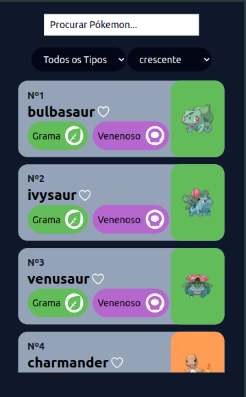

# PokeDex
Essa aplicação foi criada afins de estudo no front-end.
Todos os dados foram pegos na [PokeApi](https://pokeapi.co/docs/v2)

<div class="menu" style="display:flex; gap:10px;">
  <label for="#doc"><a href="#doc">Documentação</a></label>
  <label for="#frontInstall"><a href="#frontInstall">Rodando Front-End</a></label>
  <label for="#viewApp"><a href="#viewApp">Visualizando a Aplicação</a></label>
</div>
<br/>
🛠 Tecnologias

As seguintes ferramentas foram usadas na construção do projeto:

- React
- TypeScript
- Tailwind

💻 Projeto
- Veja o design do projeto no [FIGMA](https://www.figma.com/design/HGl01QgXJffJxYvPzsqvkH/Pok%C3%A9dex-%2F-Pok%C3%A9mon-App-(Community)?node-id=1268-35268&t=iy7HSL4Ybl7lpiKA-1) aqui

O Pokedex foi desenvolvido para fans de pokemon. Os usuários podem:

- Visualizar 20 Pokemon's.
- Visualizar um Pokemon especifico.
- Buscar Pokemon por nome ou número.
- Marcar e desmarcar conquistas como feitas.


<h2 id="doc">Documentação</h2>

### Necessário:

  Para rodar o projeto na sua máquina é necessário ter o GIT e o NODE.JS instalados. Verifique as versões de ambos e, se for preciso, atualize para a versão mais recente.

### Clonando o Repositório:
  Primeiro, clone o código para sua máquina usando o comando:

```
git clone https://github.com/gabriel-vitebo/PokeDex.git
```
Depois de terminar o clone, no seu editor de código, você verá a pasta com os conteúdos do projeto.

### Instalando as Dependências:

Agora, com o projeto clonado, instale as dependências:

`npm install`

Isso instalará todos os pacotes necessários para rodar o projeto.

<h3 id="frontInstall">Rodando o Front-End</h3>
Com todas as dependências instaladas, rode o projeto com o comando:

`npm run dev`

O terminal exibirá um link similar a este:

`Local:   http://localhost:5173/`

Acesse o link no navegador para visualizar a aplicação.

<h3 id="viewApp">Visualizando a Aplicação</h3>

### Quando a página carregar, essa será a tela inicial da aplicação:



🚀 Funcionalidades Futuras
### A aplicação está em desenvolvimento e as seguintes funcionalidades serão integradas em breve:

- Paginar para pegar todos os Pokemon's
- Criar a funcionalidade de adicionar Pokemon's a sua pokedex


### Autor

---

<a href="https://www.linkedin.com/in/gabriel-alves-vitebo-2978ab177/">
 
 <br />
 <sub><b>Gabriel Vitebo</b></sub></a> <a href="https://www.linkedin.com/in/gabriel-alves-vitebo-2978ab177/" >✅</a>

Feito com ❤️ por Gabriel Vitebo 👋🏽 Entre em contato!

<div > 
  <a href="https://www.instagram.com/gabrielvitebo/" target="_blank"></a>
  <a href="https://www.linkedin.com/in/gabriel-alves-vitebo-2978ab177/" target="_blank"></a>
  <a href="mailto:vitebo@outlook.com" ></a>
</div>